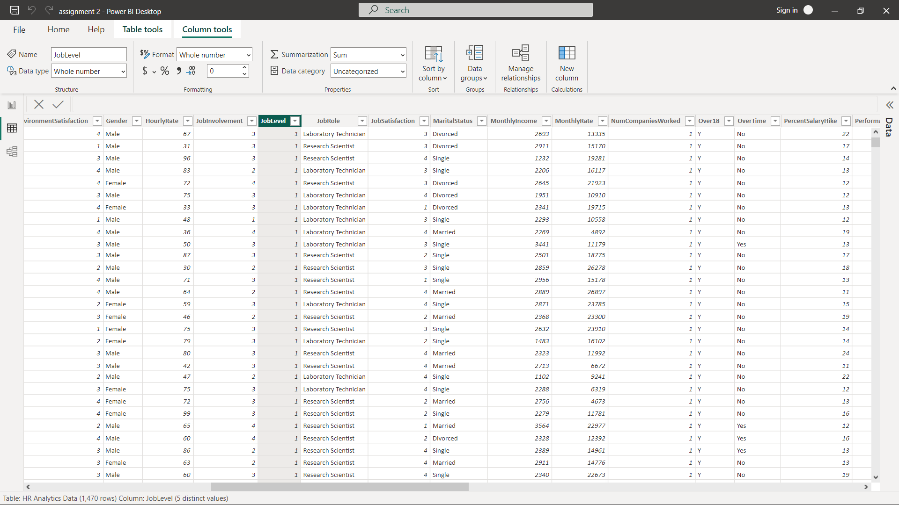

# Human-Resource

## Introduction:

I came across the dataset online and I was curious to engage it since that was my first time of getting in contact with a clustered dataset. The aim of the project is to sharpen my skills in data cleaning, data analyzes, and building interactive visualization on PowerBI.

**_Disclaimer_** : _The dataset used for this project does not belong to or in any way represnt any company, organization, institution etc. IT is an abstract dataset created for the purpose of learning._

The report consists of three pages:
  1. Home Page 
  2. Details Page  
  3. Action Page 

## PowerBI Concepts Applied:
  - DAX Concepts 
  - Calculate Column
  - Add Columns 
  - Add New Measures

## Problem of Statement:
  1. What's the total number of employees the company has? 
  2. What is the percentage of employees that that would be retrenched and the percentage in service? 
  3. What are the percentage employees due and not due for promotion? 
  4. What are the number of employees by service year? 

## Data Sourcing:
The data set was gotten from YouTube via 
(https://www.youtube.com/redirect?event=video_description&redir_token=QUFFLUhqa0VfMkhwZkFNdl9NOENvUDZpbHM2bWo2OEtBUXxBQ3Jtc0tuUkhfdjVGRDVPWWdfaXdzZDYwZ3BJZ3hOS1pjOG9jUC1HZEQ2WFVlUXJzYkFiVktyOUVhRmVMdEUzQ0xLUDFPeTVpWVNQNHE3WmR0d2szaS1xUnJYWm14b0pMQzFXZk5lS3JacTVuZHllOHhKaUd5cw&q=https%3A%2F%2Fdrive.google.com%2Ffile%2Fd%2F1h4bvZlHJUFAYJ5CbleAmLr6muAX1Q7rm%2Fview%3Fusp%3Dsharing&v=0BKlUySopU4)

## Data Transformation/Cleaning
The data was thoroughly cleaned and transformed with the Power Query Editor of Power BI. 

**_Here are a few of the data cleaning steps_**
1. Making the first row of every column the header. 
2. Transforming YearsAtCompany to Service Year by adding new column and naming it Service Year. 

YearsAtCompany           |   Service Year
:-----------------------:|:-------------------:
  |  

3. Transforming JobLevel column to Job Levels.

JobLevel                 |             Job Levels
:-----------------------:|:-----------------------------:
        |       

4. Using Conditional Formatting to add Promotion Status, Retrenchment Status, Service Year, Performance Rating Status Columns etc.

You can interact with the report [here] (https://app.powerbi.com/groups/me/reports/d0df3ed7-fe80-4909-901f-c17603b27cf9)

## The company has a total number of 1,470 employees with three departments, namely:
- Human Resource
- Sales
- Research and Development

## Conclusion:
Research and Development department is a vital department that should be given an adequate attention. The employess in the department constitute a total of 40% work force of the entire company.

## Recommendation:
The model view of the report should be carried out in other to show the relationship between these three distinct departments.

